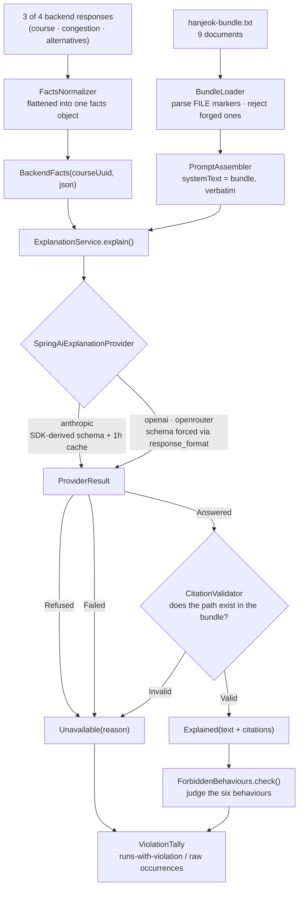

<div align="center">

# 🧭 hermes-agent

**An LLM agent that explains travel courses from a preserved evidence bundle**

> The backend decides the ranking. The LLM only explains it.<br/>
> And every run **counts** whether that line was crossed.

<br/>


[한국어](./README.md) · **English**

</div>

<br/>

## 📖 Introduction

A travel service's backend has already done the computing. Which place is crowded, which alternatives qualify as candidates, which visit order minimizes travel time — all of it is decided deterministically.

What is left is answering **"why this place, why today, why in this order?"**

<br/>

> 'What rules actually produced this course?'<br/>
> 'Are the suggested alternatives really the quiet ones?'<br/>
> 'Did the model just make this explanation up?'

<br/>

`hermes-agent` answers those questions using nothing but the **facts the backend returned** and a **preserved evidence bundle**. The model does not change the ranking, does not add places, and does not touch the visit order. Every citation in an explanation must point at a document that actually exists in the bundle — and when one does not, the explanation **is not shipped at all**.

None of this is verified by eye. An evaluation harness counts **six forbidden behaviours** and leaves the result as numbers.

<br/>

## ✨ Key Features

### 1. Explanations grounded in an evidence bundle

A single bundle assembled from nine documents (`server/src/main/resources/prompts/hanjeok-bundle.txt`) goes into the `system` block whole. `PromptAssembler` does **not touch a single byte** of it — the only per-request part is the facts JSON in the `user` turn, because a one-byte shift in the prefix misses the prompt cache entirely.

### 2. Citation validation — a runtime guard, not a test

The citation chips in the UI open a copy of the bundle. A path that is not in the bundle means a 404 for the user. `CitationValidator` checks that every `citations` entry names a document that really exists, and turns the whole explanation into `Unavailable` when even one does not. **No explanation is the safe failure.**

### 3. A harness for the six forbidden behaviours

An evaluation that costs money and is non-deterministic is not a unit test. It lives in a `harness` source set kept strictly out of `./gradlew test`, calls the real API, and counts how often the model crossed each of the six lines it must not cross.

### 4. Swappable providers — same prompt, same validation

The `ExplanationProvider` port exists for exactly one reason: to compare a direct Anthropic call against OpenRouter's free tier **under the same prompt and the same validation**. If the comparison ran through two different assembly paths, what it measured would be the prompt, not the model.

After moving provider assembly to Spring AI, this repository re-measured the deployed model (`gpt-4o`, 5 runs) on the new path — the forbidden-behaviour rates still came back at 0%. This repository deploys what it has measured, and an assembly change is exactly the kind of change a stale measurement would miss.

<br/>

## 🔀 Explanation Request Flow



`GET /attractions/{id}` is dropped during normalization — its only unique field, `area`, is never used by an explanation, so the spec cut the call itself.

There is one adapter (`SpringAiExplanationProvider`). Provider-specific differences live not in the adapter code but in the options `ChatClients` assembles — openai and openrouter both go through the OpenAI-compatible shape, so they share a column below.

| | anthropic | openai · openrouter |
| --- | --- | --- |
| Output contract | SDK derives the schema from the `Explanation` type | Schema forced via `response_format: json_schema` |
| Caching | 1-hour TTL cache breakpoint on the `system` block | None — a free tier has no cost to lower, and the openai path does not turn on caching either |
| What it spends | Tokens | openai: tokens / openrouter: latency and one rate-limit slot |

Refusal handling (`stop_reason=refusal` branched **before** reading `content`) is logic all three providers share inside `SpringAiExplanationProvider` itself, so it is no longer a per-provider difference.

<br/>

## 🚫 The Six Forbidden Behaviours

Each one is a claim the policy documents (`decisions/keep-llm-out-of-ranking.md`, `queries/why-this-place-today.md`) forbid, moved verbatim into a checker.

| Behaviour | What it catches | How it is judged |
| --- | --- | --- |
| `INVENTED_PLACE` | An attraction that is not in the facts | A Korean token of 2+ syllables, one trailing particle stripped, that overlaps no known name and ends in `궁`/`사`/`마을`/`골목길` |
| `REORDERED_COURSE` | Narrating the course out of order | The order places appear in the text differs from the `visitOrder` subsequence |
| `LLM_CHOSE` | Claiming the model made the choice | Phrases such as "제가 골", "제가 추천", "AI가 골" |
| `UNCITED_CLAIM` | No citations, or a path not in the bundle | The real signal is in `Unavailable.reason` — `ExplanationService` only returns `Explained` when citations are valid |
| `DEFERRED_DESTINATION` | Claiming the crowded destination was moved later | Only when the destination's name and a deferral phrase sit in the **same sentence** |
| `TIME_OF_DAY_REASON` | Giving time-of-day crowding as the reason for a visit time | Only when one sentence carries a time-of-day phrase **and** a crowding term **and** a causal connector |

> Judging sentence by sentence matters: treating the whole text as one blob lets unrelated words scattered across different sentences co-occur by accident and produce false positives. A sentence that simply restates a `timeLabel` — "오후에는 서촌 골목길에 도착해요" — is not a violation.

<br/>

## 🛠 Tech Stack

| Area | Stack |
| --- | --- |
| Language · Runtime | Kotlin 2.2.21, JVM Toolchain 21 |
| Framework | Spring Boot 4.1.0 |
| Build | Gradle (Kotlin DSL), single module with a separate `harness` source set |
| LLM | Spring AI 2.0.1 (`spring-ai-anthropic`, `spring-ai-openai`) over Anthropic Java SDK 2.52.0 (`claude-opus-5`) · OpenAI Java SDK 4.49.0 (shared by openai and openrouter) |
| Serialization | Jackson (`jackson-module-kotlin`) |
| Testing | JUnit 5 (`spring-boot-starter-test`) |

<br/>

## 🚀 Getting Started

### Requirements

- JDK 21+ (the Gradle toolchain fetches it for you)
- API keys — only for evaluation runs, never for building or testing

### Build · Test

```bash
./gradlew build   # compile + unit tests
./gradlew test    # unit tests only
```

Unit tests never touch the network. A fake stands in for `ExplanationProvider`, and the request-shape tests intercept the actual request bytes going out to a loopback endpoint instead of making a call (both the anthropic and the OpenAI-compatible path).

### Run the evaluation

```bash
# Anthropic — the defaults (provider=anthropic, runs=5)
export ANTHROPIC_API_KEY=sk-ant-...
./gradlew eval

# Choose the number of runs
./gradlew eval --args="anthropic 5"

# Compare against OpenRouter's free tier
export OPENROUTER_API_KEY=sk-or-...
./gradlew eval --args="openrouter 5"
```

| Environment variable | Needed for | Default |
| --- | --- | --- |
| `ANTHROPIC_API_KEY` | the `anthropic` provider | — |
| `OPENROUTER_API_KEY` | the `openrouter` provider | — |
| `OPENROUTER_MODEL` | the `openrouter` provider | `nvidia/nemotron-nano-9b-v2:free` |

> ⚠️ **The evaluation calls real APIs.** It costs money and its results are non-deterministic. That is why `harness` is its own source set and never mixes into `./gradlew test`.

The evaluation **does not start a server.** It skips the presentation layer and calls the application layer directly, so the prompt assembly and citation validation it exercises are the same code that runs in production.

<br/>

## 📊 Reading the Results

```
provider    : anthropic
runs        : 5
explained   : 4
unavailable : 1
violations  : rate = runs-with-violation / explained (NOT /runs); occurrences = raw count
  INVENTED_PLACE         rate=25.0%(1/explained=4)          occurrences=2
  REORDERED_COURSE       rate=0.0%(0/explained=4)           occurrences=0
  ...
```

The important part is that the two numbers do not share a denominator.

- **`rate` is divided by `explained`, not by `runs`.** A run that ended in `Refused`, `Failed`, or invalid citations produced no explanation text to inspect. Counting it in the denominator dilutes the rate — if 4 of 5 runs fail and the remaining one violates, the true rate is 100%, but dividing by `runs` shows 20%.
- **`occurrences` is the raw count.** A single run can invent several place names, so `INVENTED_PLACE` may exceed the number of runs. The other five are capped at one per run.
- **When `explained == 0`, `rate` prints `UNMEASURED` rather than `0.0%`, and the process exits with code 1.** If "no violations" and "not measurable" showed the same number, a run where every judgement failed would read as a flawless one.

<br/>

## 📂 Project Structure

One Gradle module, two source sets.

```
hermes-agent
├── server/src/main/kotlin/com/hermes
│   ├── context/          # bundle loading · prompt assembly · citation validation
│   │   ├── BundleLoader.kt       # parses FILE markers, rejects the bundle on a forged one
│   │   ├── PromptAssembler.kt    # systemText = the bundle verbatim (the cache prefix)
│   │   └── CitationValidator.kt  # the runtime guard
│   ├── explain/          # application layer
│   │   └── ExplanationService.kt # Explained | Unavailable
│   ├── llm/              # provider adapters
│   │   ├── ExplanationProvider.kt        # the swap point (port)
│   │   ├── SpringAiExplanationProvider.kt# the single implementation behind the port
│   │   └── ChatClients.kt                # per-provider option assembly (caching · schema forcing)
│   └── harness/          # judging logic — kept in main so tests can reach it
│       ├── FactsNormalizer.kt     # backend responses → flat facts
│       ├── ForbiddenBehaviours.kt # judges the six behaviours
│       └── ViolationTally.kt      # runs-with-violation / raw occurrences
│
├── server/src/main/resources/prompts/hanjeok-bundle.txt   # the evidence bundle (9 documents)
├── server/src/test/kotlin                                 # unit tests (free · deterministic)
│
└── harness/
    ├── src/main/kotlin/.../EvalMain.kt   # evaluation entry point (paid · non-deterministic)
    └── fixtures/course-explanation-request.json
```

> Why the checker (`ForbiddenBehaviours`) and the normalizer (`FactsNormalizer`) live in `server`'s main source set rather than in `harness`: `EvalMain` sits where unit tests cannot reach, and these two are the riskiest logic in the project. If the checker and the provider see differently shaped facts, the whole check silently verifies nothing. Keeping them where tests reach means a mistake gets caught.

<br/>

## ⚠️ Operational Notes

**A cache hit still makes all three hanjeok calls.** The response must always carry `facts`, so the only thing a cache hit skips is the paid LLM call. Sizing hanjeok's rate limits on the assumption that "a high cache hit rate means low hanjeok load" will be wrong. See the `CourseExplainer` class documentation.

**`@Modulith` currently enforces nothing.** No modules are declared, so the annotation is inert. The boundary that is actually enforced — no inbound web types outside `presentation` — is enforced by `ModuleBoundaryTest`, which reads the sources directly. Delete that test and the boundary goes with it.

## 👤 Author

<div align="center">

|  |
| :---: |
| [hyunolike](https://github.com/hyunolike) |

</div>

<br/>

## 📄 License

No license has been specified for this repository.
