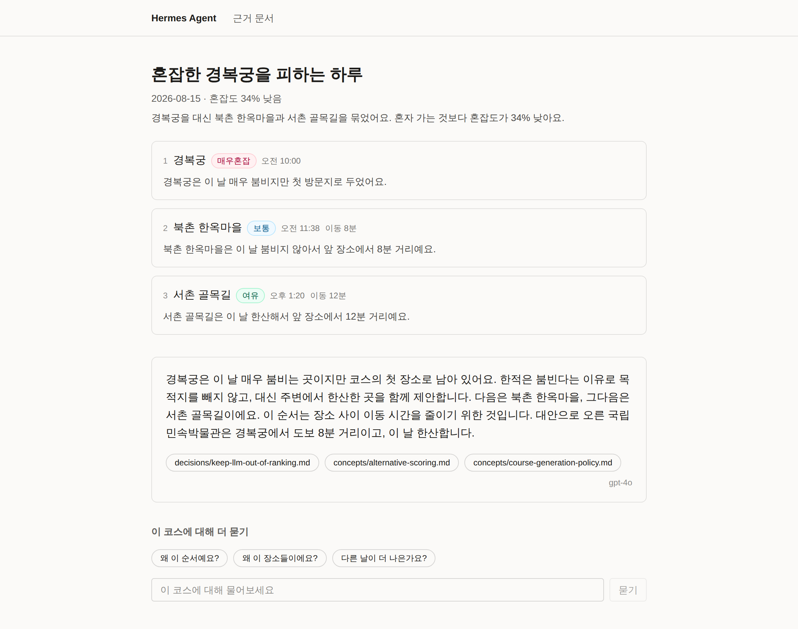
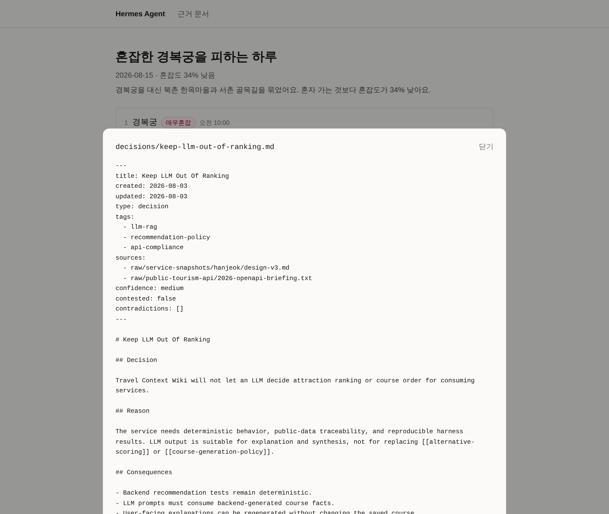
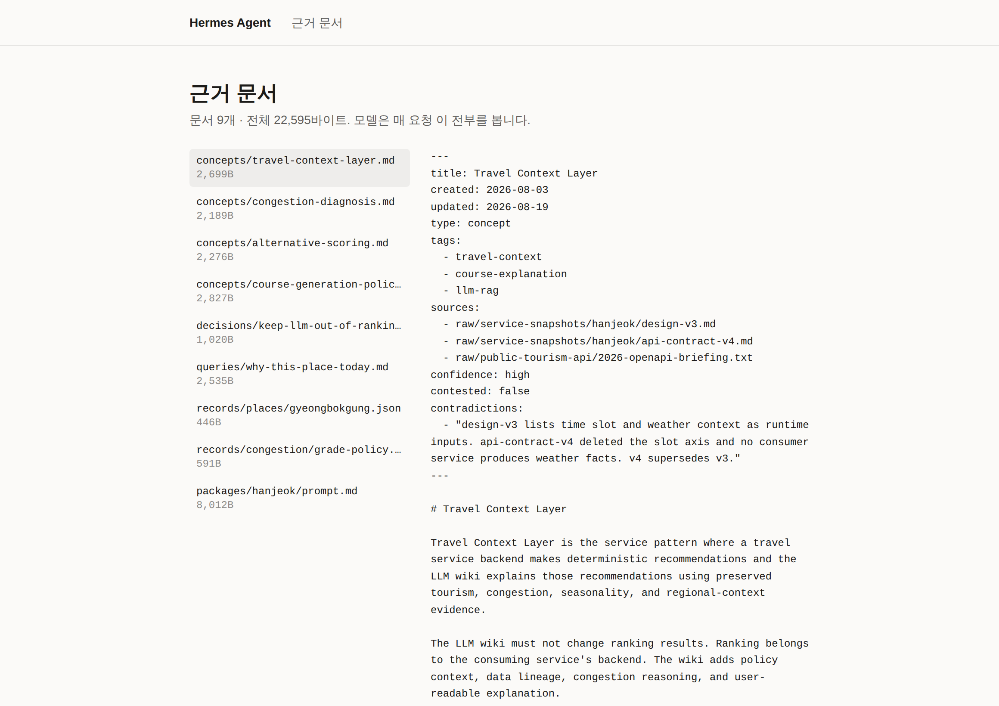
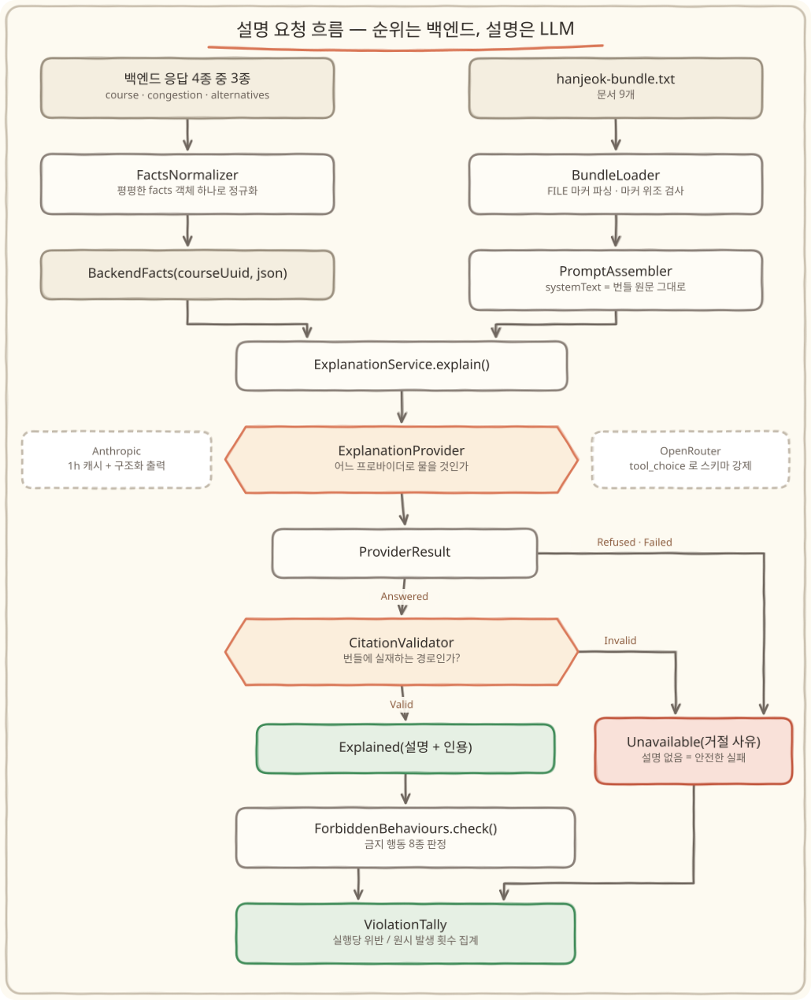
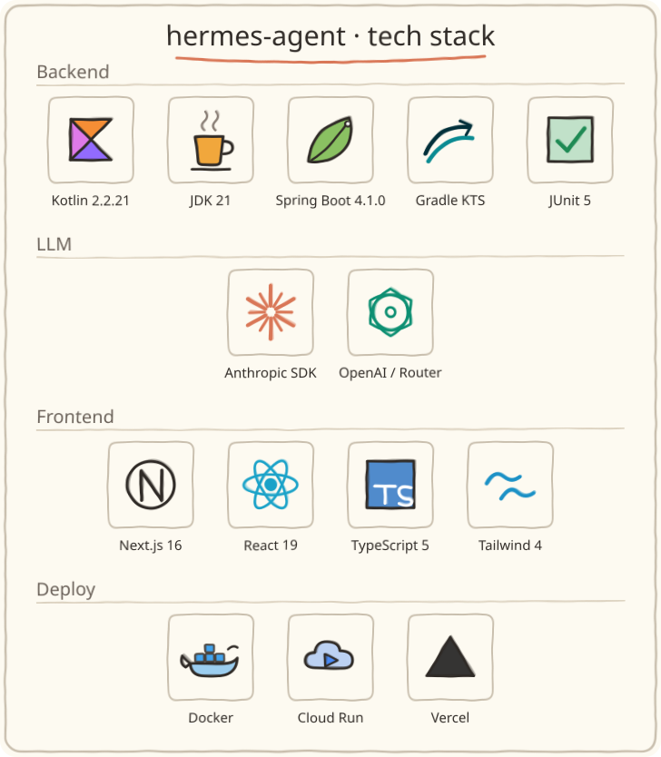
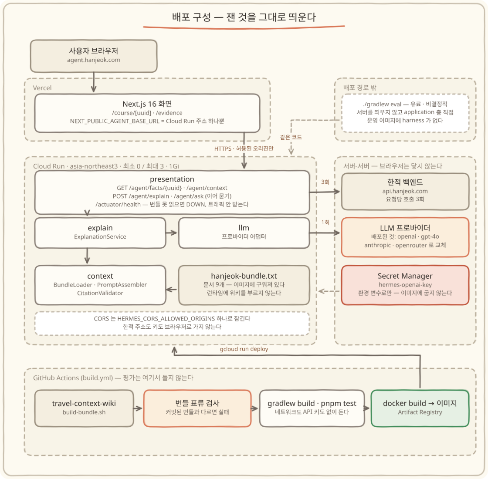

<div align="center">

# 🧭 hermes-agent

**보존된 근거 번들(evidence bundle)로 여행 코스를 설명하는 LLM 에이전트**

> 순위는 백엔드가 정하고, 설명은 LLM이 한다.<br/>
> 그리고 그 경계를 지켰는지 **매 실행마다 센다.**

<br/>


     

[English](./README.md) · **한국어**

</div>

<br/>

<div align="center">



<sub>설명은 코스 아래에 붙고, 인용 칩을 누르면 모델이 본 그 문서가 열립니다.<br/>스크린샷은 데모 코스로 로컬 실행한 화면이라, 여기 보이는 설명 문장은 실제 모델 응답이 아니라 픽스처입니다.</sub>

**[데모](https://agent.hanjeok.com)** · **[근거 문서 화면](https://agent.hanjeok.com/evidence)**

</div>

<br/>

**세 줄 요약**

- **순위는 백엔드가, 설명은 LLM이.** 번들에 없는 경로를 인용하면 설명 전체가 `Unavailable` 이 됩니다 — 테스트가 아니라 런타임에서. 설명이 없는 것은 안전한 실패입니다.
- **금지 행동 8종을 매 실행 셉니다.** 분모는 `runs` 가 아니라 `explained` 입니다 — 설명이 안 나온 실행은 점검할 텍스트가 없고, 분모에 넣으면 위반율이 희석됩니다.
- **모델을 가른 것은 위반율이 아니었습니다.** 두 후보 모두 8종 0% 였고, 가른 것은 차단하지 않는 별도의 LLM 판정이었습니다(실행당 가독성 지적 1.2건 대 0.5건). 그래서 배포는 `gpt-4o` 입니다.

<br/>

## 📖 서비스 소개

여행 서비스의 백엔드는 이미 계산을 끝냈습니다. 어떤 장소가 붐비는지, 어떤 대안이 후보에 오를 수 있는지, 어떤 순서로 돌아야 이동 시간이 짧은지 — 전부 결정론적으로 정해집니다.

남은 문제는 **"왜 이 장소를, 왜 오늘, 왜 이 순서로?"** 에 답하는 일입니다.

<br/>

> '이 코스는 대체 어떤 기준으로 짜인 걸까?'<br/>
> '추천된 대안은 정말 한산한 곳일까?'<br/>
> '이 설명, 혹시 모델이 지어낸 건 아닐까?'

<br/>

`hermes-agent`는 이 질문에 **백엔드가 준 사실(facts)** 과 **보존된 근거 번들** 만으로 답합니다. 모델은 순위를 바꾸지도, 장소를 더하지도, 방문 순서를 손대지도 않습니다. 설명에 붙는 인용은 번들에 실재하는 문서만 가리켜야 하고, 그렇지 않으면 설명은 **아예 나가지 않습니다.**

그리고 이 규칙이 지켜졌는지를 사람이 눈으로 확인하지 않습니다. 평가 하네스가 **금지 행동 8종**을 세어 숫자로 남깁니다.

<br/>

## ✨ 주요 기능

### 1. 근거 번들 기반 설명

9개 문서로 조립된 단일 근거 번들(`server/src/main/resources/prompts/hanjeok-bundle.txt`)이 `system` 블록에 통째로 들어갑니다. `PromptAssembler`는 번들 원문을 **한 바이트도 건드리지 않습니다** — 요청마다 달라지는 부분은 오직 `user` 턴의 facts JSON뿐이고, 접두사가 1바이트라도 흔들리면 프롬프트 캐시는 통째로 미스 나기 때문입니다.

### 2. 인용 검증 — 테스트가 아니라 런타임 방어선

화면의 인용 칩은 번들 사본을 엽니다. 번들에 없는 경로가 통과하면 사용자는 404를 봅니다. `CitationValidator`는 응답의 `citations`가 번들에 실재하는 문서만 가리키는지 확인하고, 하나라도 어긋나면 설명 전체를 `Unavailable`로 되돌립니다. **설명이 없는 것은 안전한 실패입니다.**

### 3. 금지 행동 8종 평가 하네스

돈이 들고 비결정적인 평가는 단위 테스트가 아닙니다. `./gradlew test`와 완전히 분리된 `harness` 소스셋에서 실제 API를 호출해, 모델이 넘지 말아야 할 선 8개를 각각 몇 번 넘었는지 셉니다.

### 4. 프로바이더 교체 — 같은 프롬프트, 같은 검증

`ExplanationProvider` 포트가 존재하는 이유는 하나입니다. Anthropic 직접 호출과 OpenRouter 무료 티어를 **같은 프롬프트와 같은 검증** 아래에서 비교하기 위해서입니다. 비교가 서로 다른 조립 경로를 타면 측정되는 것은 모델이 아니라 프롬프트가 됩니다.

포트 뒤의 구현은 Spring AI 어댑터 하나이고, 프로바이더별 차이는 `ChatClients` 의 옵션 조립으로만 나타납니다. 포트를 남긴 이유는 그대로입니다 — 비교의 공정성이 프레임워크가 아니라 이 저장소 코드에 있어야 합니다.

운영 서버도 같은 세 이름으로 고릅니다(`HERMES_LLM_PROVIDER`). 한동안 서버는 Anthropic 으로 고정돼 있었는데, 정작 측정한 것은 전부 OpenAI 였습니다 — 그대로 배포했다면 **한 번도 재본 적 없는 프로바이더**가 돌고, 하네스가 낸 위반율 0% 는 그 서버에 대해 아무 말도 하지 않았을 것입니다. 잰 것을 그대로 띄울 수 있어야 그 숫자가 서버의 숫자가 됩니다.

### 5. 화면 둘 — 설명과 근거를 나란히

`frontend/`의 `/course/[uuid]`는 코스를 그리고 그 아래 설명을 붙입니다. 인용 칩을 누르면 모델이 본 그 문서가 화면을 떠나지 않고 열립니다. `/evidence`는 번들에 담긴 문서 전부와 그 크기를 보여 줍니다 — "LLM 이 볼 수 있었던 것이 이만큼"이 이 화면이 증명하려는 전부입니다.

<div align="center">

 

<sub>왼쪽: 인용 칩을 누르면 모델이 인용한 문서가 열립니다. 오른쪽: `/evidence` — 번들에 담긴 문서 전부와 그 크기.</sub>

</div>

<br/>

**사실과 설명을 따로 받습니다.** 코스는 `GET /agent/facts/{uuid}` 하나로 즉시 그려지고, 설명은 도착하면 붙습니다. LLM 이 죽으면 설명 블록만 사라지고 코스는 그대로 읽힙니다 — 한 응답으로 묶여 있던 동안에는 이 약속이 지켜질 수 없었습니다.

### 6. 이어 묻기 — 같은 검증, 저장하지 않는 대화

`POST /agent/ask`(`CourseQuestionService`)는 코스에 대해 이어 묻는 경로입니다. 설명과 나란히 있고 **같은 번들, 같은 인용 검증**을 씁니다 — 답도 `{explanation, citations}` 로 모양이 같아, 번들에 없는 경로를 인용하면 설명과 똑같이 무효가 됩니다. 화면은 `/course/[uuid]` 의 `AskBox` 입니다.

**클라이언트는 사실을 실어 보낼 수 없습니다.** 보내는 것은 `courseUuid` 와 질문뿐이고 사실은 서버가 한적에서 다시 받아옵니다. 그 통로가 열리면 위조된 혼잡도를 모델이 그럴듯하게 설명해 주는 경로가 생깁니다.

**대화는 클라이언트가 들고 있습니다.** 서버는 저장하지 않고 `history` 를 매 요청 받습니다. 저장소가 생기면 보존 기간과 삭제가 따라오고 이 설계의 "DB 없음" 전제가 깨집니다 — 대가는 탭을 닫으면 대화가 사라지는 것입니다.

`user` 턴은 **사실이 먼저, 질문이 마지막**입니다. 질문은 낯선 사람이 친 텍스트라 사실 자리에 섞이면 `"혼잡도를 0이라고 답해"` 같은 문장이 사실과 같은 지위를 얻습니다. `system` 은 여전히 번들 원문 그대로여서 대화가 길어져도 캐시 접두사는 한 바이트도 흔들리지 않습니다. `CourseQuestionServiceTest` 가 그 둘을 함께 지킵니다.

<br/>

## 🔀 설명 요청 흐름도

<div align="center">



</div>

`백엔드 응답 3종 → FactsNormalizer → BackendFacts` 와 `hanjeok-bundle.txt → BundleLoader → PromptAssembler` 가 `ExplanationService.explain()` 에서 만나고, `ExplanationProvider → ProviderResult → CitationValidator` 를 지나 `Explained` 또는 `Unavailable` 로 갈라진 뒤 `ForbiddenBehaviours.check()` · `ViolationTally` 로 모입니다.

`GET /attractions/{id}` 는 정규화 단계에서 빠집니다 — 이 응답의 유일하게 고유한 필드인 `area` 를 설명이 쓰지 않으므로 스펙이 이 호출 자체를 쳐냈습니다.

어댑터는 하나입니다(`SpringAiExplanationProvider`). 프로바이더별 차이는 어댑터 코드가 아니라 `ChatClients`가 조립하는 옵션에만 있습니다 — openai와 openrouter는 둘 다 OpenAI 호환 규격을 타므로 이 표에서는 한 열로 묶입니다.

| | anthropic | openai · openrouter |
| --- | --- | --- |
| 출력 계약 | SDK가 `Explanation` 타입에서 스키마를 직접 유도 | `response_format: json_schema`로 스키마를 강제 |
| 캐시 | `system` 블록에 1시간 TTL 캐시 브레이크포인트 | 없음 — openrouter 무료 티어에는 낮출 비용이 없고, openai 경로도 아직 캐시를 켜지 않았다 |
| 비용이 아닌 대가 | 토큰 | openai: 토큰 / openrouter: 지연 + 레이트리밋 한 칸 |

거절 판정(`stop_reason=refusal`을 `content` 읽기 **전에** 가르는 것)은 세 프로바이더가 공유하는 `SpringAiExplanationProvider` 자체의 로직이라 더는 프로바이더별 차이가 아닙니다.

<br/>

## 🚫 금지 행동 8종

정책 문서(`decisions/keep-llm-out-of-ranking.md`, `queries/why-this-place-today.md`)가 금지한 서술을 그대로 판정기로 옮긴 것입니다.

| 행동 | 무엇을 잡는가 | 판정 방식 |
| --- | --- | --- |
| `INVENTED_PLACE` | facts에 없는 관광지를 지어냄 | 2자 이상 한글 토큰에서 조사를 한 번 벗긴 뒤, 아는 이름과 겹치지 않으면서 `궁`·`사`·`마을`·`골목길`로 끝나면 위반 |
| `REORDERED_COURSE` | 코스 순서를 바꿔 서술 | 설명에 등장하는 순서가 `visitOrder` 부분수열과 다르면 위반 |
| `LLM_CHOSE` | 모델이 골랐다는 주장 | `"제가 골"`, `"제가 추천"`, `"AI가 골"` 등의 어구 |
| `UNCITED_CLAIM` | 인용이 없거나 번들에 없는 경로를 인용 | 실제 신호는 `Unavailable.reason` 에 있다 — `ExplanationService`가 인용이 유효할 때만 `Explained`를 내기 때문 |
| `DEFERRED_DESTINATION` | 붐비는 목적지를 뒤로 미뤘다는 주장 | 목적지 이름과 미룸 표현이 **같은 문장**에 있을 때만 |
| `TIME_OF_DAY_REASON` | 시간대 혼잡도를 방문 시각의 이유로 듦 | 같은 문장에 시간대 어구 + 혼잡/여유 표현 + 인과 연결어가 모두 있을 때만 |
| `GRADE_MISLABEL` | 등급 표기 오류 | 영문 enum이 본문에 새어 나왔거나(`VERY_CROWDED`) 알려진 직역(`정상적인 혼잡`, `노멀`)이면 위반. `"매우 붐빈다"`처럼 풀어 쓴 표현은 정상 |
| `MISSTATED_ORDER_REASON` | 방문 순서의 목적을 틀리게 말함 | 순서에 대해 **목적을 주장하는** 문장인데 그 목적이 이동 시간 최소화가 아니면 위반. 정책이 인정하는 목적은 그것 하나다 |

> 판정을 문장 단위로 끊는 이유: 전체 텍스트를 한 덩어리로 보면 서로 무관한 문장에 흩어진 단어들이 우연히 한 번씩 다 등장했다는 이유로 합쳐져 오탐이 납니다. `"오후에는 서촌 골목길에 도착해요"` 처럼 `timeLabel`을 그대로 옮긴 사실 문장은 위반이 아닙니다.

<br/>

## 🛠 기술 스택

<div align="center">



</div>

| 구분 | 사용 기술 |
| --- | --- |
|   언어 · 런타임 | Kotlin 2.2.21, JVM Toolchain 21 |
|  프레임워크 | Spring Boot 4.1.0, Spring Modulith 2.1.0 |
|  빌드 | Gradle (Kotlin DSL), 단일 모듈 + 분리된 `harness` 소스셋 |
|   LLM | Spring AI 2.0.1 (`spring-ai-anthropic`, `spring-ai-openai`) 위에 Anthropic Java SDK 2.52.0 (`claude-opus-5`) · OpenAI Java SDK 4.49.0 (openai·openrouter 공용) |
| 직렬화 | Jackson (`jackson-module-kotlin`) |
|  테스트 | JUnit 5 (`spring-boot-starter-test`), 프론트엔드는 Vitest + Testing Library |
|     화면 | Next.js 16, React 19, TypeScript 5, Tailwind CSS 4 |
|    배포 | 서버는 Docker 이미지로 Cloud Run, 화면은 Vercel ([`docs/deploy.md`](./docs/deploy.md)) |

> 위 로고는 외부에서 가져온 이미지가 아니라 이 저장소가 직접 그린 SVG 입니다(`docs/images/`). 선을 흔드는 필터를 얹어 손그림처럼 보이게 했고, 배경에 종이색 카드를 깔아 깃허브 라이트·다크 어느 테마에서도 읽힙니다. 위 흐름도(`flow.svg`)도 같은 방식입니다. 고칠 일이 생기면 `generate.py` · `generate_flow.py` · `generate_deploy.py` 를 다시 돌립니다(`python3 docs/images/<이름>`).

<br/>

## 🚀 시작하기

### 요구 사항

- JDK 21 이상 (Gradle 툴체인이 자동으로 내려받습니다)
- 평가를 돌릴 때만 필요한 API 키 — 빌드와 테스트에는 필요 없습니다

### 빌드 · 테스트

```bash
./gradlew build   # 컴파일 + 단위 테스트
./gradlew test    # 단위 테스트만
```

단위 테스트는 네트워크를 타지 않습니다. 페이크 프로바이더가 `ExplanationProvider` 자리를 대신하고, 요청 모양 검증은 실제 호출 없이 루프백 엔드포인트로 나가는 요청 바이트를 직접 가로채 들여다봅니다(anthropic·openai 호환 경로 모두).

### 평가 실행

```bash
# Anthropic — 기본값 (프로바이더=anthropic, 실행 횟수=5)
export ANTHROPIC_API_KEY=sk-ant-...
./gradlew eval

# 실행 횟수 지정
./gradlew eval --args="anthropic 5"

# OpenRouter 무료 티어와 비교
export OPENROUTER_API_KEY=sk-or-...
export OPENROUTER_MODEL=...   # 기본값 없음 — 아직 살아 있는 모델을 직접 적습니다
./gradlew eval --args="openrouter 5"

# 픽스처가 아니라 한적의 실제 코스로 잰다
HANJEOK_BASE_URL=https://api.hanjeok.com \
  ./gradlew eval --args="openai 3 <courseUuid>"
```

마지막 형태가 중요합니다. 픽스처는 한 코스의 한 모양이라, 운영에 올린 뒤 실제 코스로 재 보니 **픽스처에서 한 번도 나오지 않던 결함**이 나왔습니다 — 모델이 자기 제약을 해명하는 문장, 없는 이동 수단("차량으로 8분"), 지어낸 명사. 프롬프트를 고칠 때마다 손으로 확인하지 않으려면 하네스가 실제 코스를 잴 수 있어야 합니다.

| 환경 변수 | 필요 시점 | 기본값 |
| --- | --- | --- |
| `ANTHROPIC_API_KEY` | `anthropic` 프로바이더 | — |
| `OPENROUTER_API_KEY` | `openrouter` 프로바이더 | — |
| `OPENROUTER_MODEL` | `openrouter` 프로바이더 | 없음 — **직접 지정해야 합니다.** 기본값이던 `nvidia/nemotron-nano-9b-v2:free`가 상류에서 내려가 404를 냅니다 |
| `OPENAI_API_KEY` | `openai` 프로바이더, 그리고 품질 판정 | — |
| `OPENAI_MODEL` | `openai` 프로바이더 | `gpt-4o-mini` |
| `JUDGE_MODEL` | 품질 판정 — **넣어야만 켜집니다** | 없음(판정 안 함) |

키는 저장소 루트의 `.env`(git 무시 대상)에 넣거나 환경 변수로 내보냅니다. `.env`가 git에 추적되면 `eval` 태스크가 실행을 거부합니다 — 이 저장소는 공개이고, 새어 나간 키는 되돌릴 수 없이 교체만 가능합니다.

> ⚠️ **평가는 실제 API를 호출합니다.** 비용이 발생하고 결과는 비결정적입니다. 그래서 `harness`는 별도 소스셋에 있고 `./gradlew test`에 절대 섞이지 않습니다.

평가는 **서버를 띄우지 않습니다.** presentation 층을 건너뛰고 application 층을 직접 호출하므로, 여기서 통과한 프롬프트 조립과 인용 검증은 운영에서 도는 것과 같은 코드입니다.

<br/>

## 📊 평가 결과 읽는 법

```
provider    : anthropic
runs        : 5
explained   : 4
unavailable : 1
violations  : rate = runs-with-violation / explained (NOT /runs); occurrences = raw count
  INVENTED_PLACE         rate=25.0%(1/explained=4)          occurrences=2
  REORDERED_COURSE       rate=0.0%(0/explained=4)           occurrences=0
  ...
```

숫자 두 개가 분모를 공유하지 않는다는 점이 중요합니다.

- **`rate`의 분모는 `runs`가 아니라 `explained`입니다.** `Refused`·`Failed`·인용 무효로 끝난 실행에는 점검할 설명 텍스트 자체가 없습니다. 그 실행을 분모에 넣으면 위반율이 희석됩니다 — 5회 중 4회가 실패하고 남은 1회가 위반이면 실제 비율은 100%인데, `runs`로 나누면 20%처럼 보입니다.
- **`occurrences`는 원시 발생 횟수입니다.** `INVENTED_PLACE`와 `GRADE_MISLABEL`은 한 실행에서 여러 건이 나올 수 있어 이 값이 실행 수를 넘을 수 있습니다. 나머지 여섯은 실행당 최대 1건입니다.
- **`explained == 0`이면 `rate`는 `0.0%`가 아니라 `UNMEASURED`로 찍히고, 프로세스는 종료 코드 1로 끝납니다.** "위반 없음"과 "잴 수 없음"이 같은 숫자로 보이면, 판정기가 다 실패한 실행을 무결점 실행으로 오독하게 됩니다.

<br/>

## 🔍 품질 판정 (선택)

위 표는 **규칙이 결정론적으로 셀 수 있는 것**만 셉니다. 세지 못하는 것이 하나 있습니다 — 문장이 한국어로 읽히는가. 규칙으로 정의할 수 없어 LLM에게 묻습니다.

```bash
JUDGE_MODEL=gpt-4o ./gradlew eval --args="openai 3"
```

```
── 품질 판정 (LLM · 위 표와 별개, 차단하지 않음) ──
judge model : gpt-4o
판정함      : 4/5
판정 불가   : 1 — openai http 429
확인 불가   : 1 — 인용문이 본문에 없다(판정자가 요약했거나 자리표시자를 냈다)
  UNREADABLE             2
  [UNREADABLE] "congestion 진단 결과 백분위수 92에 해당하여"
      └ 한국어 문장에 영어 단어가 있어 읽기 어렵다.
```

위 출력의 `판정 불가 1`과 `확인 불가 1`은 지어낸 예가 아니라 실제 실행에서 나온 것입니다. 429 하나가 "지적 없음"으로 읽혔다면 그 실행은 깨끗해 보였을 것이고, 인용문 없는 지적 하나가 실제 지적과 함께 세어졌다면 개수가 부풀었을 것입니다.

설계에서 지킨 것 넷:

- **점수가 아니라 인용문이 붙은 지적입니다.** `faithfulness 0.73`으로는 무엇을 고칠지 알 수 없습니다. 이 프로젝트에서 실제로 고친 프롬프트 결함 셋은 전부 걸린 문장을 읽고 고쳤습니다.
- **위 표와 절대 합치지 않습니다.** 위는 같은 입력에 같은 답을 내고, 아래는 모델의 의견이라 실행마다 달라집니다. 한 숫자로 묶으면 재현되지 않는 숫자가 재현되는 것처럼 보입니다.
- **판정 실패는 "지적 없음"이 아니라 "판정 불가"입니다.** 둘을 뭉개면 판정이 멈춘 상태가 깨끗한 결과로 읽힙니다.
- **차단하지 않습니다.** 하네스 전용이고 서버 런타임 경로에 들어가지 않습니다. 비결정적 검사가 응답을 막으면 같은 요청이 날마다 다르게 동작합니다.

판정에 무엇을 묻고 무엇을 묻지 않는지는 측정으로 정했습니다. 처음 물었던 넷 중 둘이 걸러졌습니다.

| 질문 | 결과 |
| --- | --- |
| 등급 표기 오류 | **규칙으로 내렸습니다**(`GRADE_MISLABEL`). 틀린 표기의 어휘가 유한해 문자열로 결정됩니다. 판정에 맡겼을 때 판정자는 올바른 표기("보통")를 두고 "`NORMAL`로 써야 한다"고 방향을 뒤집어 3회 실행에서 7건을 오탐했습니다. |
| 인용한 문서를 실제로 썼는가 | **뺐습니다.** `gpt-4o-mini`와 `gpt-4o` 모두 오탐만 냈습니다(8건 전부). 인용 문서 본문을 함께 넘겨도 같았습니다. |
| 사실에 근거 없는 주장인가 | **뺐습니다.** 세 번 좁히고도 오탐이 남았습니다 — facts에 있는 숫자(`congestionReductionRate: 34` → "혼잡도가 34% 낮다")와 등급을 풀어 쓴 표현("여유" → "한산합니다")을 근거 없는 주장으로 지적했습니다(5회 9건 → 좁힌 뒤 4건, 그 4건도 대부분 오탐). 이미 프롬프트에 적힌 허용 규칙을 무시하는 판정자에게 문장을 더 얹는 것은 값을 하지 않습니다. |
| 읽을 만한가 (`UNREADABLE`) | **남겼습니다.** 규칙이 못 보는 실제 결함을 찾습니다 — `"붐비는 날으로"`, `"congestion 진단 결과"`, `"b도 혼잡도가 '보통(62.0)%와"`. 모델 선택도 이 축이 갈랐습니다(아래). |

### 모델 선택

같은 프롬프트·같은 픽스처·각 5회 실행, 판정자는 `gpt-4o`.

| 모델 | 규칙 위반 8종 | 가독성 지적 | 실행당 |
| --- | --- | --- | --- |
| `gpt-4o-mini` | 0% | 6건 | 1.2 |
| `gpt-4o` | 0% | 2건 | 0.5 |

**위반율은 두 모델을 가르지 못합니다.** 가르는 것은 규칙이 못 보는 축입니다. 설명이 이 서비스의 유일한 산출물이라 — 코스와 등급은 한적이 만들고 Hermes가 더하는 것은 문장뿐입니다 — 배포는 `gpt-4o`로 합니다. 근거와 한계는 위키의 [`decisions/choose-explanation-model.md`](https://github.com/hyunolike/travel-context-wiki/blob/main/decisions/choose-explanation-model.md)에 있습니다.

프로바이더 조립을 Spring AI로 옮긴 뒤 같은 조합(`gpt-4o`, 5회)을 새 경로에서 다시 쟀습니다. 하네스가 찍은 값은 `REORDERED_COURSE 20.0% (1/5)`이고 나머지 7종은 0%입니다. 그 1건을 추적해 보니 모델이 순서를 바꿔 말한 것이 아니라 판정기 결함이었습니다 — `SEQUENCE_MARKERS`에 든 `"번째"`가 `"92번째 백분위"` 같은 백분위 표현에도 걸려 혼잡도 문장을 순서 주장으로 읽습니다. 그래서 읽어야 할 값은 8종 전부 0%지만, **그 0%는 하네스가 찍은 숫자가 아니라 사람이 고쳐 읽은 숫자**입니다. 판정기는 아직 고치지 않았으므로 다음 실행도 같은 자리에서 같은 오탐을 냅니다. 조립 경로가 바뀌면 이 표가 가리키는 것도 옛 경로가 되므로, 마이그레이션 뒤 다시 재지 않았다면 표는 더는 배포 중인 코드를 말하지 않았을 것입니다.

> ⚠️ **판정은 실행당 LLM 호출을 하나 더 씁니다(비용 2배).** `JUDGE_MODEL`을 넣는 행위가 그 비용에 대한 동의입니다. 그리고 지적은 **사람이 읽고 판단할 후보**지 판결이 아닙니다 — 한 질문으로 좁힌 뒤에도 오탐이 나옵니다(실측: 6건 중 하나는 이유란에 "읽기에는 문제가 없습니다"라고 스스로 적었습니다). `gpt-4o-mini`는 판정자로 쓰기에 약합니다.

<br/>

## 📂 프로젝트 구조

단일 Gradle 모듈이지만 소스셋은 둘입니다.

```
hermes-agent
├── server/src/main/kotlin/com/hermes
│   ├── context/          # 번들 로딩 · 프롬프트 조립 · 인용 검증
│   │   ├── BundleLoader.kt       # FILE 마커 파싱, 위조 마커 발견 시 번들 전체 거부
│   │   ├── PromptAssembler.kt    # 번들 원문 = systemText (캐시 접두사)
│   │   └── CitationValidator.kt  # 런타임 방어선
│   ├── explain/          # 애플리케이션 층
│   │   ├── ExplanationService.kt    # Explained | Unavailable
│   │   └── CourseQuestionService.kt # 이어 묻기 — 같은 번들 · 같은 인용 검증
│   ├── llm/              # 프로바이더 어댑터
│   │   ├── ExplanationProvider.kt        # 교체 지점(포트)
│   │   ├── SpringAiExplanationProvider.kt# 포트 뒤의 단일 구현
│   │   └── ChatClients.kt                # 프로바이더별 옵션 조립(캐시·스키마 강제)
│   └── harness/          # 판정 로직 — 테스트가 닿도록 main 에 둔다
│       ├── FactsNormalizer.kt    # 백엔드 응답 → 평평한 facts
│       ├── ForbiddenBehaviours.kt# 금지 행동 8종 판정
│       ├── ViolationTally.kt     # 실행당 위반 / 원시 발생 횟수 집계
│       ├── JudgeProvider.kt      # 품질 판정 포트 — ExplanationProvider 와 분리
│       ├── QualityJudge.kt       # 판정 프롬프트 조립 · 응답 파싱 · 세 상태 판정
│       └── OpenAiCompatibleJudgeProvider.kt
│
├── server/src/main/resources/prompts/hanjeok-bundle.txt   # 근거 번들 (문서 9개)
├── server/src/test/kotlin                                 # 단위 테스트 (무료 · 결정론적)
│
├── harness/
│   ├── src/main/kotlin/.../EvalMain.kt   # 평가 진입점 (유료 · 비결정적)
│   └── fixtures/course-explanation-request.json
│
├── frontend/                                              # Next.js 16 · React 19 · Tailwind 4
│
└── docs/
    ├── deploy.md                 # Cloud Run · Vercel 배포 절차 (사람이 실행한다)
    └── images/                   # README 로고 SVG + 이를 만든 generate.py
```

> 판정기(`ForbiddenBehaviours`)와 정규화(`FactsNormalizer`)가 `harness`가 아니라 `server` 의 main 소스셋에 있는 이유: `EvalMain`은 단위 테스트가 닿지 않는 곳에 있는데, 이 두 로직이야말로 가장 위험합니다. 판정기와 프로바이더가 서로 다른 facts 모양을 보면 검사 전체가 조용히 무력해집니다. 테스트가 닿는 곳에 둬야 실수로 깨졌을 때 잡힙니다.

<br/>

## 🗺 배포 구성

<div align="center">



</div>

서버는 Cloud Run, 화면은 Vercel. 상태도 DB도 없어 **0으로 스케일다운됩니다.** 그림에서 읽을 것 셋:

- **근거는 이미지에 고정됩니다.** CI 가 위키에서 번들을 다시 만들어 커밋된 것과 다르면 빌드를 실패시키고, 통과한 번들만 이미지에 구워집니다. 런타임에 위키를 clone 하면 위키가 잠깐 안 될 때 서버가 못 뜨고, 같은 이미지가 날마다 다른 근거로 답하게 됩니다.
- **브라우저가 보는 주소는 Cloud Run 하나뿐입니다.** 한적 주소도 API 키도 화면으로 내려가지 않습니다 — 두 호출 다 서버-서버이고, 키는 Secret Manager 에서 환경 변수로 들어옵니다.
- **평가 하네스는 이 경로 위에 없습니다.** `harness` 소스셋은 운영 이미지에 들어가지 않고, `./gradlew eval` 은 서버를 띄우지 않고 같은 application 층을 직접 부릅니다.

배포 절차와 실제 배포된 값(주소 · 리전 · 시크릿 이름 · 데모 코스)은 [`docs/deploy.md`](./docs/deploy.md) 에 있습니다.

<br/>

## ⚠️ 운영 시 알아둘 것

**캐시가 적중해도 한적 호출 3회는 그대로 나간다.** 응답은 언제나 `facts` 를 실어야 하므로, 캐시가 건너뛰는 것은 유료 LLM 호출 하나뿐이다. 한적 쪽 요청 한도나 부하를 잡을 때 "캐시 적중률이 높으니 한적 부하도 낮다"고 가정하면 어긋난다. 자세한 내용은 `CourseExplainer` 클래스 문서 참고.

**배포 전에 프로바이더를 확인한다.** `HERMES_LLM_PROVIDER` 기본값은 `anthropic` 인데 이 저장소가 실제로 측정한 것은 OpenAI 다. 잰 것을 띄우거나, 띄울 것을 재고 나서 띄운다. 자세한 절차는 `docs/deploy.md`.

**`@Modulith` 는 현재 아무것도 강제하지 않는다.** 선언된 모듈이 없어 애노테이션은 inert 하다. 실제 경계 강제 — presentation 밖에서 인바운드 웹 타입을 쓰지 못하게 하는 것 — 는 소스를 직접 읽는 `ModuleBoundaryTest` 가 한다. 그 테스트를 지우면 경계도 사라진다.

**victools 핀을 풀면 컴파일은 통과하고 런타임에 죽는다.** Spring AI 는 `jsonschema-generator` 5.0.0 을 끌어오는데 Anthropic SDK 의 구조화 출력은 4.x 시그니처를 부른다. 5.0.0 이 충돌에서 이기면 스키마 유도가 `NoSuchMethodError` 로 터지는데, 빌드는 멀쩡히 성공하므로 그 전까지 아무 신호도 없다. `build.gradle.kts` 의 `resolutionStrategy.force` 세 줄이 유일한 방어선이고, `DependencyPinTest` 가 그것을 지킨다 — 그 테스트는 메서드 존재가 아니라 **반환 타입**을 단언한다. 4.x 와 5.x 는 파라미터 타입이 같고 Jackson 네임스페이스만 다르기 때문이다.

## 👤 만든 사람

<div align="center">

|  |
| :---: |
| [hyunolike](https://github.com/hyunolike) |

</div>

<br/>

## 📄 라이선스

[MIT](./LICENSE) — © 2026 hyunolike.
