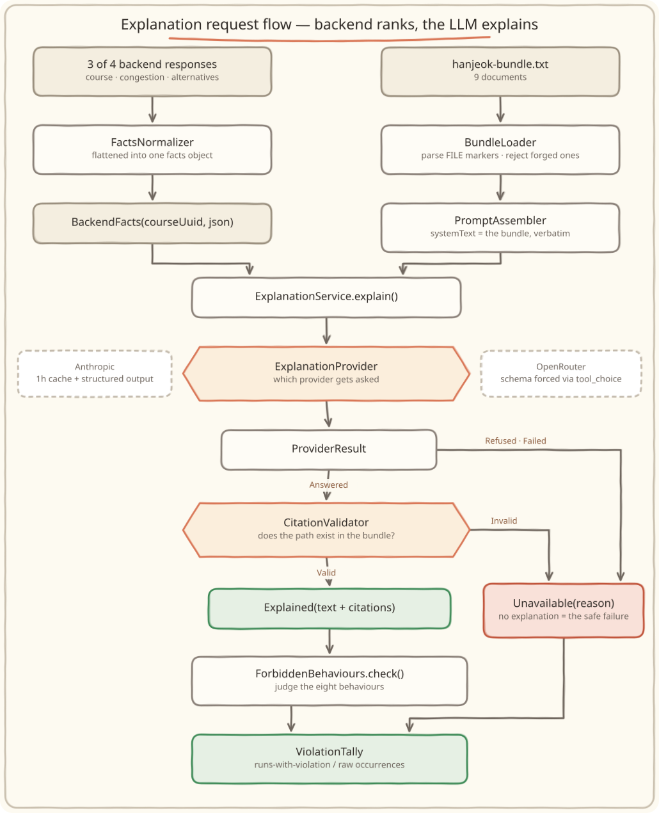

<div align="center">

# 🧭 hermes-agent

**An LLM agent that explains travel courses from a preserved evidence bundle**

> The backend decides the ranking. The LLM only explains it.<br/>
> And every run **counts** whether that line was crossed.

<br/>


     

**English** · [한국어](./README.ko.md)

</div>

<br/>

## 📖 Introduction

A travel service's backend has already done the computing. Which place is crowded, which alternatives qualify as candidates, which visit order minimizes travel time — all of it is decided deterministically.

What is left is answering **"why this place, why today, why in this order?"**

<br/>

> 'What rules actually produced this course?'<br/>
> 'Are the suggested alternatives really the quiet ones?'<br/>
> 'Did the model just make this explanation up?'

<br/>

`hermes-agent` answers those questions using nothing but the **facts the backend returned** and a **preserved evidence bundle**. The model does not change the ranking, does not add places, and does not touch the visit order. Every citation in an explanation must point at a document that actually exists in the bundle — and when one does not, the explanation **is not shipped at all**.

None of this is verified by eye. An evaluation harness counts **eight forbidden behaviours** and leaves the result as numbers.

<br/>

## ✨ Key Features

### 1. Explanations grounded in an evidence bundle

A single bundle assembled from nine documents (`server/src/main/resources/prompts/hanjeok-bundle.txt`) goes into the `system` block whole. `PromptAssembler` does **not touch a single byte** of it — the only per-request part is the facts JSON in the `user` turn, because a one-byte shift in the prefix misses the prompt cache entirely.

### 2. Citation validation — a runtime guard, not a test

The citation chips in the UI open a copy of the bundle. A path that is not in the bundle means a 404 for the user. `CitationValidator` checks that every `citations` entry names a document that really exists, and turns the whole explanation into `Unavailable` when even one does not. **No explanation is the safe failure.**

### 3. A harness for the eight forbidden behaviours

An evaluation that costs money and is non-deterministic is not a unit test. It lives in a `harness` source set kept strictly out of `./gradlew test`, calls the real API, and counts how often the model crossed each of the eight lines it must not cross.

### 4. Swappable providers — same prompt, same validation

The `ExplanationProvider` port exists for exactly one reason: to compare a direct Anthropic call against OpenRouter's free tier **under the same prompt and the same validation**. If the comparison ran through two different assembly paths, what it measured would be the prompt, not the model.

The server picks from the same three names (`HERMES_LLM_PROVIDER`). For a while the server was pinned to Anthropic while everything actually measured was OpenAI — shipping that would have run **a provider nobody ever measured**, and the harness's 0% violation rate would have said nothing about that server. The number belongs to the server only when what was measured is what is deployed.

### 5. Two screens — the explanation next to its evidence

`frontend/`'s `/course/[uuid]` draws the course and puts the explanation beneath it. Clicking a citation chip opens the exact document the model saw, without leaving the page. `/evidence` lists every document in the bundle with its size — "this much is what the LLM could see" is all that screen sets out to prove.

**Facts and explanation arrive separately.** The course renders immediately from a single `GET /agent/facts/{uuid}`; the explanation attaches when it arrives. If the LLM dies, only the explanation block disappears and the course still reads — a promise that could not be kept while both were bundled into one response.

### 6. Follow-up questions — same validation, no stored conversation

`POST /agent/ask` (`CourseQuestionService`) answers follow-up questions about a course. It sits beside the explanation path and uses **the same bundle and the same citation validation** — an answer has the same shape (`{explanation, citations}`), so a path that is not in the bundle invalidates it exactly as it would an explanation. The UI for it is the `AskBox` on `/course/[uuid]`.

**The client cannot send facts.** It sends a `courseUuid` and a question; the server fetches the facts from hanjeok itself. Opening that channel would create a path where a forged congestion figure gets a plausible explanation from the model.

**The client holds the conversation.** The server stores nothing and takes `history` with every request. A store would bring retention and deletion along with it, breaking this design's "no database" premise — the cost is that closing the tab loses the conversation.

The `user` turn puts **the facts first and the question last**. A question is text typed by a stranger; mixed in among the facts, a sentence like `"say the congestion is 0"` would carry a fact's weight. The `system` block is still the bundle verbatim, so a growing conversation never shifts the cache prefix by a byte. `CourseQuestionServiceTest` pins both.

<br/>

## 🔀 Explanation Request Flow

<div align="center">



</div>

`3 backend responses → FactsNormalizer → BackendFacts` and `hanjeok-bundle.txt → BundleLoader → PromptAssembler` meet in `ExplanationService.explain()`, pass through `ExplanationProvider → ProviderResult → CitationValidator`, split into `Explained` or `Unavailable`, and end up in `ForbiddenBehaviours.check()` · `ViolationTally`.

`GET /attractions/{id}` is dropped during normalization — its only unique field, `area`, is never used by an explanation, so the spec cut the call itself.

The two providers differ only inside their adapters.

| | Anthropic | OpenRouter |
| --- | --- | --- |
| Output contract | SDK derives the schema from the `Explanation` type | A single function call forced via `tool_choice` |
| Caching | 1-hour TTL cache breakpoint on the `system` block | None — a free tier has no cost to lower |
| Refusals | `stop_reason=refusal` branched **before** reading `content` | Judged from the HTTP status code |
| What it spends | Tokens | Latency and one rate-limit slot |

<br/>

## 🚫 The Eight Forbidden Behaviours

Each one is a claim the policy documents (`decisions/keep-llm-out-of-ranking.md`, `queries/why-this-place-today.md`) forbid, moved verbatim into a checker.

| Behaviour | What it catches | How it is judged |
| --- | --- | --- |
| `INVENTED_PLACE` | An attraction that is not in the facts | A Korean token of 2+ syllables, one trailing particle stripped, that overlaps no known name and ends in `궁`/`사`/`마을`/`골목길` |
| `REORDERED_COURSE` | Narrating the course out of order | The order places appear in the text differs from the `visitOrder` subsequence |
| `LLM_CHOSE` | Claiming the model made the choice | Phrases such as "제가 골", "제가 추천", "AI가 골" |
| `UNCITED_CLAIM` | No citations, or a path not in the bundle | The real signal is in `Unavailable.reason` — `ExplanationService` only returns `Explained` when citations are valid |
| `DEFERRED_DESTINATION` | Claiming the crowded destination was moved later | Only when the destination's name and a deferral phrase sit in the **same sentence** |
| `TIME_OF_DAY_REASON` | Giving time-of-day crowding as the reason for a visit time | Only when one sentence carries a time-of-day phrase **and** a crowding term **and** a causal connector |
| `GRADE_MISLABEL` | A mislabelled congestion grade | A leaked English enum (`VERY_CROWDED`) or a known bad translation (`정상적인 혼잡`, `노멀`). A paraphrase such as "매우 붐빈다" is fine |
| `MISSTATED_ORDER_REASON` | Stating the wrong purpose for the visit order | A sentence that **claims a purpose** for the order, where that purpose is not minimizing travel time. The policy recognizes exactly one |

> Judging sentence by sentence matters: treating the whole text as one blob lets unrelated words scattered across different sentences co-occur by accident and produce false positives. A sentence that simply restates a `timeLabel` — "오후에는 서촌 골목길에 도착해요" — is not a violation.

<br/>

## 🛠 Tech Stack

<div align="center">


</div>

| Area | Stack |
| --- | --- |
|   Language · Runtime | Kotlin 2.2.21, JVM Toolchain 21 |
|  Framework | Spring Boot 4.1.0, Spring Modulith 2.1.0 |
|  Build | Gradle (Kotlin DSL), single module with a separate `harness` source set |
|   LLM | Anthropic Java SDK 2.34.0 (`claude-opus-5`), OpenAI · OpenRouter Chat Completions via `java.net.http.HttpClient` |
| Serialization | Jackson (`jackson-module-kotlin`) |
|  Testing | JUnit 5 (`spring-boot-starter-test`), Vitest + Testing Library on the frontend |
|     UI | Next.js 16, React 19, TypeScript 5, Tailwind CSS 4 |
|    Deployment | The server ships as a Docker image on Cloud Run, the UI on Vercel ([`docs/deploy.md`](./docs/deploy.md)) |

> Those logos are not fetched from anywhere — this repository draws them (`docs/images/`). A displacement filter wobbles the strokes into a hand-drawn look, and a paper-coloured card behind each one keeps them readable in GitHub's light and dark themes alike. The flow diagram above (`flow.en.svg`) is drawn the same way. Run `generate.py`, `generate_flow.py` and `generate_deploy.py` under `docs/images/` to rebuild them.

<br/>

## 🚀 Getting Started

### Requirements

- JDK 21+ (the Gradle toolchain fetches it for you)
- API keys — only for evaluation runs, never for building or testing

### Build · Test

```bash
./gradlew build   # compile + unit tests
./gradlew test    # unit tests only
```

Unit tests never touch the network. A fake stands in for `ExplanationProvider`, and the request-shape tests inspect the parameters (and the OpenRouter request body) the builders produce instead of making a call.

### Run the evaluation

```bash
# Anthropic — the defaults (provider=anthropic, runs=5)
export ANTHROPIC_API_KEY=sk-ant-...
./gradlew eval

# Choose the number of runs
./gradlew eval --args="anthropic 5"

# Compare against OpenRouter's free tier
export OPENROUTER_API_KEY=sk-or-...
./gradlew eval --args="openrouter 5"

# Measure a real hanjeok course instead of the fixture
HANJEOK_BASE_URL=https://api.hanjeok.com \
  ./gradlew eval --args="openai 3 <courseUuid>"
```

That last form matters. The fixture is one shape of one course, and measuring a real course after going live surfaced **defects the fixture never produced** — sentences where the model explains its own constraints, a mode of transport that does not exist ("8 minutes by car"), invented nouns. Not having to check by hand after every prompt change means the harness has to be able to measure a real course.

| Environment variable | Needed for | Default |
| --- | --- | --- |
| `ANTHROPIC_API_KEY` | the `anthropic` provider | — |
| `OPENROUTER_API_KEY` | the `openrouter` provider | — |
| `OPENROUTER_MODEL` | the `openrouter` provider | `nvidia/nemotron-nano-9b-v2:free` |
| `OPENAI_API_KEY` | the `openai` provider, and the quality judge | — |
| `OPENAI_MODEL` | the `openai` provider | `gpt-4o-mini` |
| `JUDGE_MODEL` | the quality judge — **only runs when set** | none (no judging) |

Put the keys in a `.env` at the repository root (git-ignored) or export them. If `.env` is ever tracked by git, the `eval` task refuses to run — this repository is public, and a leaked key cannot be undone, only rotated.

> ⚠️ **The evaluation calls real APIs.** It costs money and its results are non-deterministic. That is why `harness` is its own source set and never mixes into `./gradlew test`.

The evaluation **does not start a server.** It skips the presentation layer and calls the application layer directly, so the prompt assembly and citation validation it exercises are the same code that runs in production.

<br/>

## 📊 Reading the Results

```
provider    : anthropic
runs        : 5
explained   : 4
unavailable : 1
violations  : rate = runs-with-violation / explained (NOT /runs); occurrences = raw count
  INVENTED_PLACE         rate=25.0%(1/explained=4)          occurrences=2
  REORDERED_COURSE       rate=0.0%(0/explained=4)           occurrences=0
  ...
```

The important part is that the two numbers do not share a denominator.

- **`rate` is divided by `explained`, not by `runs`.** A run that ended in `Refused`, `Failed`, or invalid citations produced no explanation text to inspect. Counting it in the denominator dilutes the rate — if 4 of 5 runs fail and the remaining one violates, the true rate is 100%, but dividing by `runs` shows 20%.
- **`occurrences` is the raw count.** A single run can invent several place names, so `INVENTED_PLACE` may exceed the number of runs. The other seven are capped at one per run.
- **When `explained == 0`, `rate` prints `UNMEASURED` rather than `0.0%`, and the process exits with code 1.** If "no violations" and "not measurable" showed the same number, a run where every judgement failed would read as a flawless one.

<br/>

## 🔍 Quality Judging (optional)

The table above counts only **what a rule can count deterministically**. One thing it cannot count is whether the sentences read as Korean. No rule defines that, so an LLM is asked instead.

```bash
JUDGE_MODEL=gpt-4o ./gradlew eval --args="openai 3"
```

```
── 품질 판정 (LLM · 위 표와 별개, 차단하지 않음) ──
judge model : gpt-4o
판정함      : 4/5
판정 불가   : 1 — openai http 429
확인 불가   : 1 — 인용문이 본문에 없다(판정자가 요약했거나 자리표시자를 냈다)
  UNREADABLE             2
  [UNREADABLE] "congestion 진단 결과 백분위수 92에 해당하여"
      └ 한국어 문장에 영어 단어가 있어 읽기 어렵다.
```

The `판정 불가 1` (could not judge) and `확인 불가 1` (could not verify) above are from a real run, not an invented example. Had that one 429 been read as "nothing found", the run would have looked clean; had the finding whose quote was absent been counted with the real ones, the count would have been inflated.

Four things the design holds to:

- **Findings with quotes, not a score.** `faithfulness 0.73` tells you nothing about what to fix. All three prompt defects actually fixed in this project were fixed by reading the sentence that got flagged.
- **Never merged with the table above.** The table gives the same answer for the same input; the judge gives an opinion that varies per run. Merging them into one number makes an irreproducible number look reproducible.
- **A failed judgement is "could not judge", not "nothing found".** Blurring the two makes a stalled judge read as a clean result.
- **It never blocks.** It is harness-only and stays out of the server's runtime path. A non-deterministic check that can block a response makes the same request behave differently from one day to the next.

What the judge is and is not asked was decided by measurement. Two of the original four questions were dropped.

| Question | Outcome |
| --- | --- |
| Mislabelled grades | **Moved into a rule** (`GRADE_MISLABEL`). The vocabulary of a wrong label is finite, so a string decides it. Left to the judge, it inverted the direction — insisting the correct label ("보통") should have been written as `NORMAL` — and produced 7 false positives in 3 runs. |
| Was the cited document actually used | **Dropped.** Both `gpt-4o-mini` and `gpt-4o` produced nothing but false positives (all 8). Passing the cited documents' text along changed nothing. |
| Claims unsupported by the facts | **Dropped.** Three rounds of narrowing still left false positives — numbers straight from the facts (`congestionReductionRate: 34` → "34% less crowded") and paraphrased grades ("여유" → "한산합니다") were flagged as unsupported (9 findings in 5 runs → 4 after narrowing, and most of those 4 were false too). Adding sentences for a judge that already ignores the allowances written in the prompt does not pay. |
| Is it readable (`UNREADABLE`) | **Kept.** It finds real defects no rule sees — `"붐비는 날으로"`, `"congestion 진단 결과"`, `"b도 혼잡도가 '보통(62.0)%와"`. This is also the axis that decided the model choice (below). |

### Model choice

Same prompt, same fixture, 5 runs each, judged by `gpt-4o`.

| Model | 8 rule violations | Readability findings | Per run |
| --- | --- | --- | --- |
| `gpt-4o-mini` | 0% | 6 | 1.2 |
| `gpt-4o` | 0% | 2 | 0.5 |

**The violation rate does not separate the two models.** What separates them is the axis no rule sees. Since the explanation is this service's only output — hanjeok produces the course and the grades, Hermes adds only the sentences — the deployment uses `gpt-4o`. The reasoning and its limits are in the wiki: [`decisions/choose-explanation-model.md`](https://github.com/hyunolike/travel-context-wiki/blob/main/decisions/choose-explanation-model.md).

> ⚠️ **Judging spends one extra LLM call per run (double the cost).** Setting `JUDGE_MODEL` is the consent to that cost. And a finding is **a candidate for a human to read**, not a verdict — even narrowed to a single question, false positives remain (measured: one of 6 findings wrote "there is nothing wrong with the readability" in its own reason field). `gpt-4o-mini` is too weak to use as the judge.

<br/>

## 📂 Project Structure

One Gradle module, two source sets.

```
hermes-agent
├── server/src/main/kotlin/com/hermes
│   ├── context/          # bundle loading · prompt assembly · citation validation
│   │   ├── BundleLoader.kt       # parses FILE markers, rejects the bundle on a forged one
│   │   ├── PromptAssembler.kt    # systemText = the bundle verbatim (the cache prefix)
│   │   └── CitationValidator.kt  # the runtime guard
│   ├── explain/          # application layer
│   │   ├── ExplanationService.kt    # Explained | Unavailable
│   │   └── CourseQuestionService.kt # follow-ups — same bundle · same validation
│   ├── llm/              # provider adapters
│   │   ├── ExplanationProvider.kt        # the swap point (port)
│   │   ├── AnthropicExplanationProvider.kt
│   │   └── OpenRouterExplanationProvider.kt
│   └── harness/          # judging logic — kept in main so tests can reach it
│       ├── FactsNormalizer.kt     # backend responses → flat facts
│       ├── ForbiddenBehaviours.kt # judges the eight behaviours
│       ├── ViolationTally.kt      # runs-with-violation / raw occurrences
│       ├── JudgeProvider.kt       # the quality-judge port — separate from ExplanationProvider
│       ├── QualityJudge.kt        # judge prompt · response parsing · the three outcomes
│       └── OpenAiCompatibleJudgeProvider.kt
│
├── server/src/main/resources/prompts/hanjeok-bundle.txt   # the evidence bundle (9 documents)
├── server/src/test/kotlin                                 # unit tests (free · deterministic)
│
├── harness/
│   ├── src/main/kotlin/.../EvalMain.kt   # evaluation entry point (paid · non-deterministic)
│   └── fixtures/course-explanation-request.json
│
├── frontend/                                              # Next.js 16 · React 19 · Tailwind 4
│
└── docs/
    ├── deploy.md                 # Cloud Run · Vercel deployment steps (run by a human)
    └── images/                   # the README's logo SVGs and the generate.py that draws them
```

> Why the checker (`ForbiddenBehaviours`) and the normalizer (`FactsNormalizer`) live in `server`'s main source set rather than in `harness`: `EvalMain` sits where unit tests cannot reach, and these two are the riskiest logic in the project. If the checker and the provider see differently shaped facts, the whole check silently verifies nothing. Keeping them where tests reach means a mistake gets caught.

<br/>

## 🗺 Deployment

<div align="center">


</div>

The server runs on Cloud Run, the UI on Vercel. With no state and no database, it **scales down to zero.** Three things to read off the diagram:

- **The evidence is pinned to the image.** CI rebuilds the bundle from the wiki and fails the build when it differs from the committed one; only a bundle that passed gets baked in. Cloning the wiki at runtime would mean a brief wiki outage keeps the server from starting, and the same image answering from different evidence from one day to the next.
- **The only address the browser sees is the Cloud Run URL.** Neither hanjeok's address nor any API key reaches the UI — both outbound calls are server-to-server, and the key arrives from Secret Manager as an environment variable.
- **The evaluation harness is not on this path.** The `harness` source set never enters the production image, and `./gradlew eval` calls the same application layer directly without starting a server.

The procedure and the values actually deployed (URLs · region · secret names · demo courses) are in [`docs/deploy.md`](./docs/deploy.md).

<br/>

## ⚠️ Operational Notes

**A cache hit still makes all three hanjeok calls.** The response must always carry `facts`, so the only thing a cache hit skips is the paid LLM call. Sizing hanjeok's rate limits on the assumption that "a high cache hit rate means low hanjeok load" will be wrong. See the `CourseExplainer` class documentation.

**Check the provider before deploying.** `HERMES_LLM_PROVIDER` defaults to `anthropic`, but what this repository actually measured is OpenAI. Deploy what was measured, or measure what will be deployed first. The procedure is in `docs/deploy.md`.

**`@Modulith` currently enforces nothing.** No modules are declared, so the annotation is inert. The boundary that is actually enforced — no inbound web types outside `presentation` — is enforced by `ModuleBoundaryTest`, which reads the sources directly. Delete that test and the boundary goes with it.

## 👤 Author

<div align="center">

|  |
| :---: |
| [hyunolike](https://github.com/hyunolike) |

</div>

<br/>

## 📄 License

No license has been specified for this repository.
